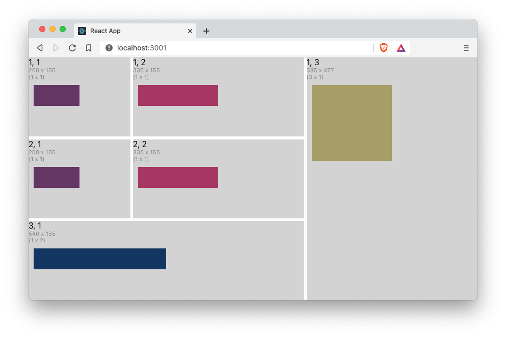

# react-resizable-grid-layout

A number of components (e.g. `<canvas/>`, `<svg/>`, `d3`, `fixed-data-tables`) used in modern react apps require that their size be specified in pixels. Making a single pixel-size-based component responsive to the page size is straightforward. Simply listen for window-resize events and recalculate the component's position and size. But, when your app uses several of these components on the same page, and you'd like to make them responsive in a natural way, recalculating their location and size becomes more difficult and cumbersome.

The react-grid-layout provides a grid layout, based on [css-grid](https://www.w3.org/TR/css-grid-1), that provides the grid-cell content with the cell's width and height. With react-grid-layout, when the size of the grid changes, you can pass the new grid-cell size to its pixel-size-based component, and have it rerender based on those new sizes.

Check out the [css-grid](https://css-tricks.com/snippets/css/complete-guide-grid/) primer for more details on css-grid, and the [react-grid-layout-example](https://github.com/robphilipp/react-grid-layout-example) repo for an example app.

## simple grid
As a simple example, the code below shows a 3 by 3 `<Grid/>` which gets it overall size from the window dimensions, in this case, the `useWindowDimensions` hook. In this example, the cells (1, 1) and (2, 1) have a fixed with as set in the grid-track-template-builder with the `.addTrack(withPixels(200), withLineNames('nav'))` call, which translates to `[nav] 200px`. All the other cells are sized as `1fr`. The `rowGap` and `columnGap` are set to 5 pixels which is what renders the white borders in this example. The code doesn't specify a `gridTemplateRows` property, and so the grid calculates the number of rows based on the coordinates of the `<GridCell/>` children and adds them sized as `1fr`.

When placing the grid-cells, you can also specify that they span several rows or columns. In this example, cell (3, 1) is set to span 2 columns, and cell (1, 3) is set to span 3 rows.

```typescript jsx
function App() {
    return (
        <Grid
            dimensionsSupplier={useWindowDimensions}
            gridTemplateColumns={gridTrackTemplateBuilder()
                .addTrack(withPixels(200), withLineNames('nav'))
                .repeatFor(2, withGridTrack(withFraction(1), 'last one'))
                .build()
            }
            rowGap={5}
            columnGap={5}
            showGrid={false}
        >
            <GridCell row={1} column={1}>
                <CellContents/>
            </GridCell>
            <GridCell row={1} column={2}>
                <CellContents/>
            </GridCell>
            <GridCell row={1} column={3} rowsSpanned={3}>
                <CellContents/>
            </GridCell>
            <GridCell row={2} column={1}>
                <CellContents/>
            </GridCell>
            <GridCell row={2} column={2}>
                <CellContents/>
            </GridCell>
            <GridCell row={3} column={1} columnsSpanned={2}>
                <CellContents/>
            </GridCell>
        </Grid>
    )
}

function CellContents(): JSX.Element {
    const {width, height, row, column, rowsSpanned, columnsSpanned} = useGridCell()
    return (
        <div style={{height}}>
            <div style={{backgroundColor: 'lightgrey', height: '100%'}}>
                <div>{row}, {column}</div>
                <div style={{fontSize: '0.7em', color: 'grey'}}>{width} x {height}</div>
                <div style={{fontSize: '0.7em', color: 'grey'}}>({rowsSpanned} x {columnsSpanned})</div>
                <Canvas width={width/2} height={height/3}/>
            </div>
        </div>
    )
}

interface CanvasProps {
    width: number
    height: number
}

function Canvas(props: CanvasProps): JSX.Element {
    const {width, height} = props;
    const canvasRef = useRef<HTMLCanvasElement>(null)

    useLayoutEffect(
        () => {
            if (canvasRef.current !== null) {
                const context = canvasRef.current.getContext('2d')
                if (context) {
                    context.fillStyle = `rgb(${width % 255}, ${height % 255}, 100)`
                    context.rect(10, 10, width - 10, height - 10)
                    context.fill()
                }
            }
        },
        [width, height]
    )

    return <canvas ref={canvasRef} width={width} height={height}/>
}
```

The cells (1, 1) and (2, 1) maintain their width at 200px when resized, and the rest of the cells are resized based on the css-grid specs. As the window is resized, the canvas element responds by changing it's size and fill color. The first image shows the window with a small size, and the second image shows the same window resized to a larger size.




## nested grid

The react-grid-layout also supports nested grids. To nest a grid, simply add a `<Grid/>` as a child of one of the parent-grid's cells. The code below shows that cell (1, 3), which spans 3 rows, now contains a nested grid, which itself is a 4 x 3 grid. Notice that the nested grid uses the `useGridCell` hook to provide it with its dimensions. For the nested grid, we again use the `gridTrackTemplateBuilder`, but this time we use the `repeatFor` function to create 3 columns, all sized as `1fr`. In this example, not all the cells are set, and so you see that the grid has empty cells are (3, 1), (1, 3), (2, 3), and (4, 3).

```typescript jsx
function App() {
    return (
        <Grid
            dimensionsSupplier={useWindowDimensions}
            gridTemplateColumns={gridTrackTemplateBuilder()
                .addTrack(withPixels(200), withLineNames('nav'))
                .repeatFor(2, withGridTrack(withFraction(1), 'last one'))
                .build()
            }
            rowGap={5}
            columnGap={5}
            showGrid={false}
        >
            <GridCell row={1} column={1}>
                <CellContents/>
            </GridCell>
            <GridCell row={1} column={2}>
                <CellContents/>
            </GridCell>
            <GridCell row={1} column={3} rowsSpanned={3}>
                <Grid
                    dimensionsSupplier={useGridCell}
                    gridTemplateColumns={gridTrackTemplateBuilder()
                        .repeatFor(3, withGridTrack(withFraction(1), 'last one'))
                        .build()}
                    columnGap={1}
                    rowGap={1}
                >
                    <GridCell column={1} row={1}>
                        <CellContents/>
                    </GridCell>
                    <GridCell column={1} row={2}>
                        <CellContents/>
                    </GridCell>
                    <GridCell column={3} row={3}>
                        <CellContents/>
                    </GridCell>
                    <GridCell column={1} row={4}>
                        <CellContents/>
                    </GridCell>
                    <GridCell column={2} row={1} rowsSpanned={4}>
                        <CellContents/>
                    </GridCell>
                </Grid>
            </GridCell>
            <GridCell row={2} column={1}>
                <CellContents/>
            </GridCell>
            <GridCell row={2} column={2}>
                <CellContents/>
            </GridCell>
            <GridCell row={3} column={1} columnsSpanned={2}>
                <CellContents/>
            </GridCell>
        </Grid>
    )
}

function CellContents(): JSX.Element {
    const {width, height, row, column, rowsSpanned, columnsSpanned} = useGridCell()
    return (
        <div style={{height}}>
            <div style={{backgroundColor: 'lightgrey', height: '100%'}}>
                <div>{row}, {column}</div>
                <div style={{fontSize: '0.7em', color: 'grey'}}>{width} x {height}</div>
                <div style={{fontSize: '0.7em', color: 'grey'}}>({rowsSpanned} x {columnsSpanned})</div>
                <Canvas width={width/2} height={height/3}/>
            </div>
        </div>
    )
}

interface CanvasProps {
    width: number
    height: number
}


function Canvas(props: CanvasProps): JSX.Element {
    const {width, height} = props;
    const canvasRef = useRef<HTMLCanvasElement>(null)

    useLayoutEffect(
        () => {
            if (canvasRef.current !== null) {
                const context = canvasRef.current.getContext('2d')
                if (context) {
                    context.fillStyle = `rgb(${width % 255}, ${height % 255}, 100)`
                    context.rect(10, 10, width - 10, height - 10)
                    context.fill()
                }
            }
        },
        [width, height]
    )

    return <canvas ref={canvasRef} width={width} height={height}/>
}
```

Now, the (1, 3) cell contains a nested `<Grid/>`.


## common app layout (grid areas)

A common app layout has a header or menu bar at the top of the page,  a footer at the bottom of the page, a navigation sidebar on the left-hand side of the page, between the header and the footer, possibly an aside panel on the right-hand side of the page, an the main content nested snugly in the center. It would also be nice to name these areas and reference them by name. `grid-areas` are a basic feature of `css-grid` which is implemented in the `<Grid/>` component. The following example code shows how to do this with `<Grid/>` and also how to control which `<GridCells/>` are displayed using the `<GridCell/>`'s `isVisible` property.

Notice that we have added a `gridTemplateAreas` property to outer the `<Grid/>`. Using the `gridTemplateAreasBuilder` we can add areas to the grid using the `addArea(name, area)` method. A grid-area has a name associated with an area (the set of cells bounded by 4 grid-lines). The `gridArea(row, col, spannedRows, spannedCols)` helper function makes it easy to define the area. All we need to do is specify the starting (row, column) and then the number of rows and columns the area spans. In our example, we've added grid-area called `header` that starts in the first row and column of the grid, spans 1 row, and spans all the columns of the grid. The `sidebar` starts on the second row of the first column and spans only one row and one column (the default values for row and column spanning).

The next difference to our previous examples, is that now the grid-cells of the outer grid specify their placement using grid-area names rather than their row, column, row-span, and column-span.

This example also shows how to make a grid-cell disappear by using the grid-cell's visibility property and dynamically changing the number of columns in the nested grid.

```typescript jsx
function App() {

    const [showLast, setShowLast] = useState<boolean>(true)

    function createNestedGridTemplateColumn(showLast: boolean): GridTrackTemplate {
        return gridTrackTemplateBuilder()
            .repeatFor(showLast ? 3 : 2, withGridTrack(withFraction(1), 'last one'))
            .build()
    }

    return (
        <Grid
            dimensionsSupplier={useWindowDimensions}
            gridTemplateColumns={gridTrackTemplateBuilder()
                .addTrack(withPixels(150))
                .addTrack(withFraction(1))
                .addTrack(withPixels(100))
                .build()
            }
            gridTemplateRows={gridTrackTemplateBuilder()
                .addTrack(withPixels(65))
                .addTrack(withFraction(1))
                .addTrack(withPixels(40))
                .build()
            }
            gridTemplateAreas={gridTemplateAreasBuilder()
                .addArea('header', gridArea(1, 1, 1, 3))
                .addArea('sidebar', gridArea(2, 1))
                .addArea('main', gridArea(2, 2))
                .addArea('aside', gridArea(2, 3))
                .addArea('footer', gridArea(3, 1, 1, 3))
                .build()
            }
            rowGap={5}
            columnGap={5}
            showGrid={false}
        >
            <GridCell gridAreaName='header'>
                <CellContents/>
            </GridCell>
            <GridCell gridAreaName='sidebar'>
                <CellContents/>
            </GridCell>
            <GridCell gridAreaName='main'>
                <Grid
                    dimensionsSupplier={useGridCell}
                    gridTemplateColumns={createNestedGridTemplateColumn(showLast)}
                    columnGap={1}
                    rowGap={1}
                >
                    <GridCell column={1} row={1}>
                        <CellContents/>
                    </GridCell>
                    <GridCell column={1} row={2}>
                        <CellContents/>
                    </GridCell>
                    <GridCell column={3} row={3} isVisible={showLast}>
                        <CellContents showRemoveButton={true} onRemoveButtonClick={() => setShowLast(false)}/>
                    </GridCell>
                    <GridCell column={1} row={4}>
                        <CellContents/>
                    </GridCell>
                    <GridCell column={2} row={1} rowsSpanned={4}>
                        <CellContents/>
                    </GridCell>
                </Grid>
            </GridCell>
            <GridCell gridAreaName='aside'>
                <CellContents/>
            </GridCell>
            <GridCell gridAreaName='footer'>
                <CellContents/>
            </GridCell>
        </Grid>
    )
}

function noop() {
    /* empty */
}

function removeButton(onClick: () => void): JSX.Element {
    return (
        <div style={{display: 'flex', justifyContent: 'space-around'}}>
            <button onClick={onClick}>Remove</button>
        </div>
    )
}

interface CellContentsProps {
    showRemoveButton?: boolean
    onRemoveButtonClick?: () => void
}

function CellContents(props: CellContentsProps): JSX.Element {
    const {showRemoveButton = false, onRemoveButtonClick = noop} = props
    const {width, height, row, column, rowsSpanned, columnsSpanned} = useGridCell()
    if (width > 130) {
        return (
            <div style={{height}}>
                <div style={{backgroundColor: 'lightgrey', height: '100%'}}>
                    <div>
                        <span>{row}, {column}</span>
                        <span style={{fontSize: '0.7em', color: 'grey', marginLeft: 7}}>{width} x {height}</span>
                        <span style={{
                            fontSize: '0.7em',
                            color: 'grey',
                            marginLeft: 7
                        }}>({rowsSpanned} x {columnsSpanned})</span>
                    </div>
                    <Canvas width={width - 20} height={height / 3}/>
                    {showRemoveButton ? removeButton(onRemoveButtonClick) : <span/>}
                </div>
            </div>
        )
    }
    return (
        <div style={{height}}>
            <div style={{backgroundColor: 'lightgrey', height: '100%'}}>
                <div>{row}, {column}</div>
                <div style={{fontSize: '0.7em', color: 'grey'}}>{width} x {height}</div>
                <div style={{fontSize: '0.7em', color: 'grey'}}>({rowsSpanned} x {columnsSpanned})</div>
                <Canvas width={width / 2} height={height / 3}/>
                {showRemoveButton ? removeButton(onRemoveButtonClick) : <span/>}
            </div>
        </div>
    )
}

interface CanvasProps {
    width: number
    height: number
}


function Canvas(props: CanvasProps): JSX.Element {
    const {width, height} = props;
    const canvasRef = useRef<HTMLCanvasElement>(null)

    useLayoutEffect(
        () => {
            if (canvasRef.current !== null) {
                const context = canvasRef.current.getContext('2d')
                if (context) {
                    context.fillStyle = `rgb(${width % 255}, ${height % 255}, 100)`
                    context.rect(10, 10, width - 10, height - 10)
                    context.fill()
                }
            }
        },
        [width, height]
    )

    return <canvas ref={canvasRef} width={width} height={height}/>
}
```
